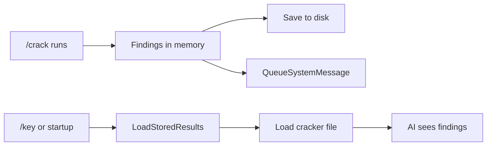

<!-- d06f1a59-1f76-4417-83c5-bed88dfbf99e b8966d7e-df22-42a8-94c3-16508009f319 -->
# Cracker Improvements Plan

## Issues to Fix

| Issue | Priority | Description |

|-------|----------|-------------|

| Findings not persisted | High | Cracker findings lost on restart, AI may not see them |

| Linux lacks FD-path mapping | Medium | Can't attribute `read(fd, ...)` content to specific files |

| Windows is polling, not interception | Medium | Hardcoded checks, not actual CCSClient interception |

## Phase 1: Persist Cracker Findings (Required)

### Problem

Findings stored only in memory. If API key added after `/crack`, or ironguard restarts, AI never sees findings.

### Solution

Save findings to `~/.ironguard/cracker_results.txt` and load in `LoadStoredResults()`.



### Changes

**[`internal/agent/cracker_adapter.go`](internal/agent/cracker_adapter.go):**

- Add `SaveFindings()` method - writes to `~/.ironguard/cracker_results.txt`
- Call `SaveFindings()` in `Stop()` and periodically during long runs

**[`internal/agent/agent.go`](internal/agent/agent.go):**

- Add `loadCrackerResults()` method (like `loadBaselineResults()`)
- Update `LoadStoredResults()` to call both

---

## Phase 2: Linux FD-to-Path Mapping (Medium Priority)

### Problem

Currently sees:

```
openat(AT_FDCWD, "/etc/passwd", O_RDONLY) = 4
read(4, "root:x:0:0:root...", 4096) = 3604
```

But doesn't connect `read(4, ...)` to `/etc/passwd`.

### Solution

Track file descriptor mappings per-PID in strace parser.

### Changes

**[`internal/cracker/interceptor_linux.go`](internal/cracker/interceptor_linux.go):**

- Add `fdMap map[int]string` to track FD-to-path mappings
- On `open/openat` returning FD N, store `fdMap[N] = path`
- On `read(N, ...)`, lookup `fdMap[N]` to get source file
- On `close(N)`, delete `fdMap[N]`
- Attach read content to the corresponding file finding

### Result

Findings include: "File `/etc/passwd` was read, content: `root:x:0:0:root...`"

---

## Phase 3: Windows Cracker Enhancements (Medium Priority)

### Problem

Current Windows cracker uses periodic polling of hardcoded registry/files, not actual CCSClient interception.

### Solution (Phase 3A - Required)

Harden existing periodic checks for Windows Server/DC environments:

- Avoid cmdlets that fail on Domain Controllers (e.g., `Get-LocalUser`)
- Add fallbacks (`net user`, CIM queries)
- Detect Windows Server roles (IIS, DNS, DHCP, AD)
- Add role-specific security checks

### Solution (Phase 3B - Optional/Future)

True interception via:

- ETW (Event Tracing for Windows) - complex but internal
- Process Monitor integration - simpler, requires external tool

### Changes for Phase 3A

**[`internal/cracker/interceptor_windows.go`](internal/cracker/interceptor_windows.go):**

- Add `detectWindowsRole()` - returns Server/DC/Workstation
- Add fallback cmdlets for DC environments
- Add IIS, DNS, DHCP, AD-specific checks
- Improve `checkUserAccounts()` to use `net user` on DC

---

## Phase 4: Cracker Lifecycle Commands (Low Priority)

### Problem

No `/crack stop` or `/crack status` in TUI - cracker runs until context cancelled.

### Solution

Add subcommands matching baseline pattern.

### Changes

**[`internal/tui/commands.go`](internal/tui/commands.go):**

```
/crack              Alias for /crack status
/crack start [dur]  Start cracker (dur: 60s, 2m, 0=indefinite)
/crack stop         Stop cracker
/crack status       Show running state + finding count
```

---

## Summary

| Phase | Scope | Files Changed |

|-------|-------|---------------|

| 1 | Persist findings | `cracker_adapter.go`, `agent.go` |

| 2 | FD-path mapping | `interceptor_linux.go` |

| 3A | Windows Server-safe | `interceptor_windows.go` |

| 3B | Windows ETW (optional) | Future work |

| 4 | Lifecycle commands | `commands.go` |

### To-dos

- [ ] Add Linux baseline improvements from score reports
- [ ] Add Windows baseline improvements from score reports
- [ ] Add theme awareness to AI system prompt
- [ ] Add web app security guidance to AI prompt
- [ ] Make updates optional (ask user, default no)
- [ ] Update README and docs/FEATURES.md
- [ ] Wait for user's last score report attachment
- [ ] Added screen lock, display manager, process limits
- [ ] Create cracker package structure, process discovery, CLI flag
- [ ] Implement Linux interceptor (auditd + strace + /proc)
- [ ] Implement Windows interceptor (ETW + WMI)
- [ ] Build check parser for file/registry/command events
- [ ] Implement analyzer with heuristics and pattern matching
- [ ] Add /crack command and TUI sidebar panel
- [ ] Inject findings as system messages to AI agent
- [ ] Create cracker package, process discovery, strace interceptor, parser
- [ ] Fix .desktop file handling for README and ScoringReport
- [ ] Ensure apt sources are correct before full-upgrade
- [ ] Update README and docs with cracker feature
- [ ] Add Linux baseline improvements from score reports
- [ ] Add Windows baseline improvements from score reports
- [ ] Add theme awareness to AI system prompt
- [ ] Add web app security guidance to AI prompt
- [ ] Make updates optional (ask user, default no)
- [ ] Update README and docs/FEATURES.md
- [ ] Wait for user's last score report attachment
- [ ] Added screen lock, display manager, process limits
- [ ] Create cracker package structure, process discovery, CLI flag
- [ ] Implement Linux interceptor (auditd + strace + /proc)
- [ ] Implement Windows interceptor (ETW + WMI)
- [ ] Build check parser for file/registry/command events
- [ ] Implement analyzer with heuristics and pattern matching
- [ ] Add /crack command and TUI sidebar panel
- [ ] Inject findings as system messages to AI agent
- [ ] Replace centered box drawing with left-aligned output in baseline.go and main.go
- [ ] Change IPv6 default to true (disable) in baseline.go
- [ ] Fix double 'v' in version string in main.go
- [ ] Require space/comma separators for service selection in baseline.go
- [ ] Fix /baseline TUI command to show defaults and require confirmation
- [ ] Fix /crack TUI command integration
- [ ] Ensure AI can access baseline/cracker results even if API key added later
- [ ] Replace centered box drawing with left-aligned output in baseline.go and main.go
- [ ] Add Linux baseline improvements from score reports
- [ ] Add Windows baseline improvements from score reports
- [ ] Add theme awareness to AI system prompt
- [ ] Add web app security guidance to AI prompt
- [ ] Make updates optional (ask user, default no)
- [ ] Update README and docs/FEATURES.md
- [ ] Wait for user's last score report attachment
- [ ] Added screen lock, display manager, process limits
- [ ] Create cracker package structure, process discovery, CLI flag
- [ ] Implement Linux interceptor (auditd + strace + /proc)
- [ ] Implement Windows interceptor (ETW + WMI)
- [ ] Build check parser for file/registry/command events
- [ ] Implement analyzer with heuristics and pattern matching
- [ ] Add /crack command and TUI sidebar panel
- [ ] Inject findings as system messages to AI agent
- [ ] Create cracker package, process discovery, strace interceptor, parser
- [ ] Fix .desktop file handling for README and ScoringReport
- [ ] Ensure apt sources are correct before full-upgrade
- [ ] Update README and docs with cracker feature
- [ ] Add Linux baseline improvements from score reports
- [ ] Add Windows baseline improvements from score reports
- [ ] Add theme awareness to AI system prompt
- [ ] Add web app security guidance to AI prompt
- [ ] Make updates optional (ask user, default no)
- [ ] Update README and docs/FEATURES.md
- [ ] Wait for user's last score report attachment
- [ ] Added screen lock, display manager, process limits
- [ ] Create cracker package structure, process discovery, CLI flag
- [ ] Implement Linux interceptor (auditd + strace + /proc)
- [ ] Implement Windows interceptor (ETW + WMI)
- [ ] Build check parser for file/registry/command events
- [ ] Implement analyzer with heuristics and pattern matching
- [ ] Add /crack command and TUI sidebar panel
- [ ] Inject findings as system messages to AI agent